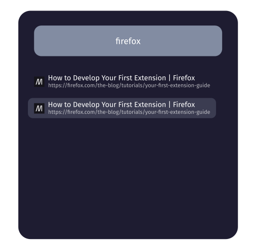

NinjaTabs
---

Ultra fast tab switching in Firefox (Chrome coming soon).

A forked and improved version of [firefox-fts](https://github.com/tapapax/firefox-fts).

Work in progress!

Improvements over firefox-fts:

- Modern, sexy UI
- Vim/Emacs keybindings
- Lightweight. No jQuery dependency
- More customizations

TODO list:

- Remove jQuery dep & integrate logic code into my new design
- Clean up crufty code
- Try to find a way to match system colors
- Customize more settings
- Chrome support
